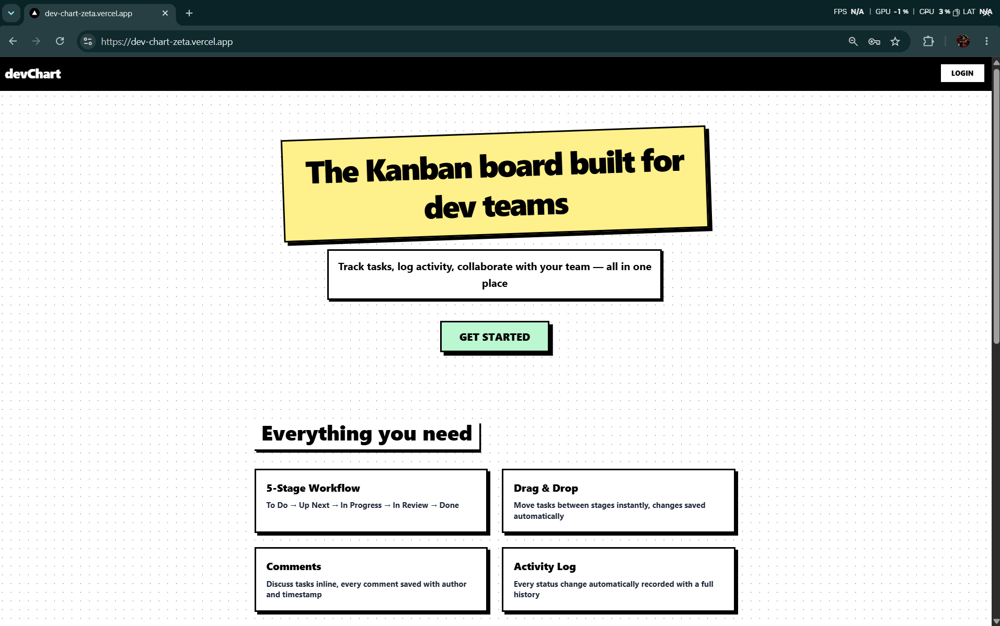
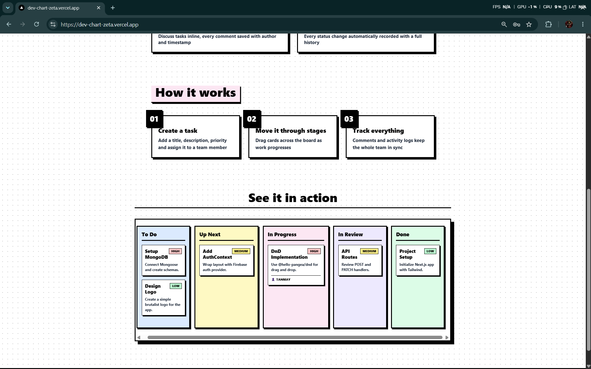
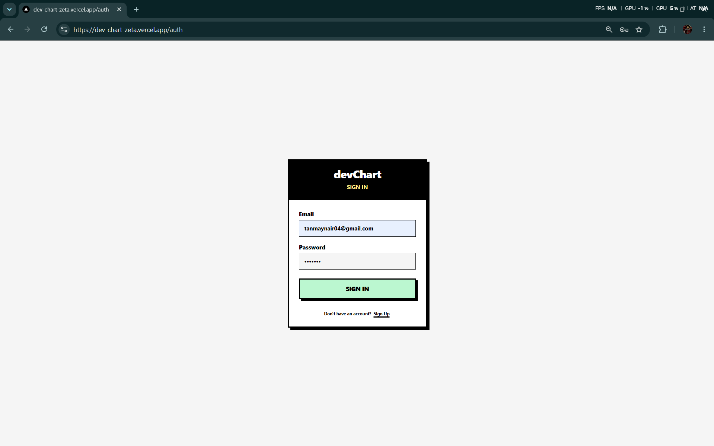
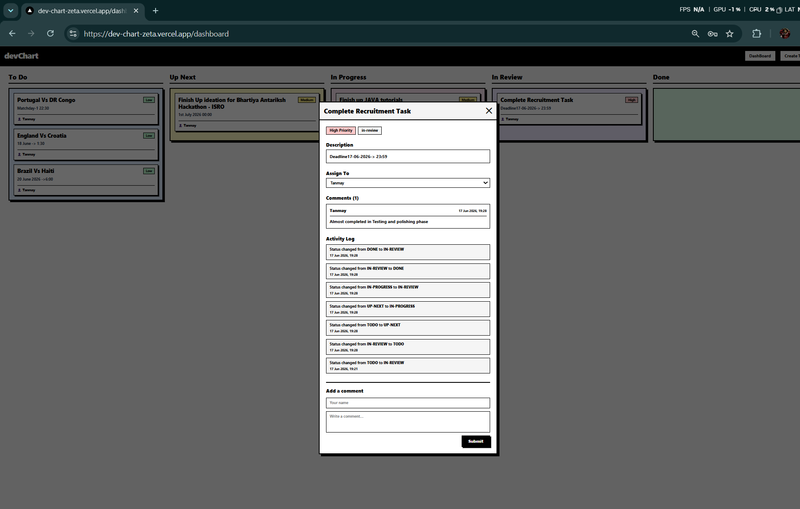

# devChart

A neobrutalist Kanban board built for dev teams. Track tasks, collaborate, and ship faster.

## Live Demo
https://dev-chart-zeta.vercel.app

---

## Tech Stack

- **Frontend:** Next.js 14 (App Router), React, TypeScript, Tailwind CSS
- **Backend:** Next.js API Routes, Mongoose
- **Database:** MongoDB Atlas
- **Auth:** Firebase Authentication (Email/Password)
- **Drag & Drop:** @hello-pangea/dnd

---

## Features

- **Rooms / Teams Feature** — organize tasks into isolated rooms guarded by entry keys. Join multiple rooms to manage different projects.
- **5-Stage Kanban Board** — To Do → Up Next → In Progress → In Review → Done
- **Drag & Drop Persistence** — drag cards between columns, status saved instantly to MongoDB
- **Task Comments** — add comments with author name, persisted per task
- **Activity Log** — every status change automatically recorded with timestamp
- **Task Assignment** — assign tasks to team members from a dropdown
- **Firebase Auth** — email/password signup and login, protected routes
- **Neobrutalist UI** — thick borders, hard offset shadows, high-contrast color blocks

---
## Screenshots

### Landing Page



### Authentication


### Dashboard & Task Detail


## Getting Started

### Prerequisites
- Node.js 18+
- MongoDB Atlas account
- Firebase project with Email/Password auth enabled

### Setup

1. Clone the repo
   ```bash
   git clone <repo-url>
   cd devChart
   ```

2. Install dependencies
   ```bash
   npm install
   ```

3. Create a `.env.local` file in the project root:
   ```env
   MONGODB_URI=your_mongodb_connection_string
   NEXT_PUBLIC_FIREBASE_API_KEY=your_firebase_api_key
   NEXT_PUBLIC_FIREBASE_AUTH_DOMAIN=your_firebase_auth_domain
   NEXT_PUBLIC_FIREBASE_PROJECT_ID=your_firebase_project_id
   NEXT_PUBLIC_FIREBASE_APP_ID=your_firebase_app_id
   ```

4. Run the development server
   ```bash
   npm run dev
   ```

5. Open http://localhost:3000

### Deployment

- Push code to GitHub
- Import repo on vercel.com
- Add all environment variables from `.env.local`
- Click Deploy

---

## Project Structure

```
src/
├── app/
│   ├── api/rooms/          # GET, POST rooms
│   ├── api/rooms/join/     # POST join room
│   ├── api/tasks/          # GET, POST tasks (scoped by roomId)
│   ├── api/tasks/[id]/     # PATCH, DELETE task + GET single
│   ├── api/tasks/[id]/comments/  # POST comment
│   ├── api/members/        # GET, POST members
│   ├── auth/               # Login/signup page
│   ├── rooms/              # Rooms Hub dashboard
│   ├── rooms/[roomId]/     # Dynamic Kanban board for a specific room
│   ├── create-task/        # Task creation form
│   └── page.tsx            # Landing page
├── components/
│   ├── TaskCard.tsx        # Card + modal (comments + activity log)
│   └── Navbar.tsx
├── models/
│   ├── Room.ts             # Room schema
│   ├── Tasks.ts            # Task schema
│   └── Member.ts           # Member schema
├── context/
│   └── AuthContext.tsx     # Firebase auth context
└── lib/
    ├── mongodb.ts          # Mongoose connection
    └── firebase.ts         # Firebase init
```

---

## Known Limitations

- Route protection is component-level, not middleware-level — brief flash before redirect on direct URL access
- No real-time updates — board requires manual refresh to see changes made by other users
- Firebase and MongoDB are not natively linked — deleting a Firebase user leaves orphaned data in MongoDB
- No pagination on tasks — performance may degrade with large numbers of tasks
